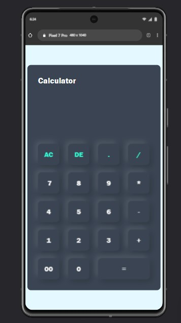

# 🧮 Calculator Pro

A fully functional and responsive scientific calculator built using **HTML, CSS, and JavaScript**. This calculator supports both basic and advanced operations including trigonometric functions, logarithmic operations, exponentiation, factorial, and more.

---

## 📷 Screenshots

<!-- Add actual screenshots if available -->

---
## 🌐 Live Demo
[Click here to try the Calculator Pro](#) <!-- Replace with your GitHub Pages or Netlify link -->

---

## 📌 Features

- ✅ Basic arithmetic: `+`, `-`, `×`, `÷`
- ✅ Answer memory: `Ans` saves the last result
- ✅ Clear (`AC`) and Delete (`DEL`) functionality
- ✅ Responsive design for mobile and desktop

---

## 🛠️ Technologies Used

- HTML5
- CSS3
- JavaScript (Vanilla)
- Font Awesome Icons
- Bootstrap Icons

